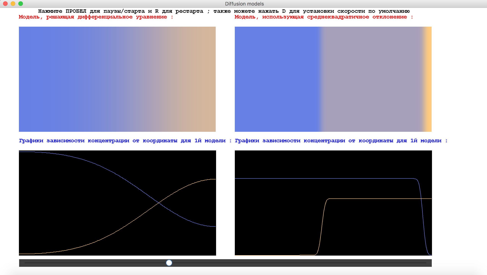
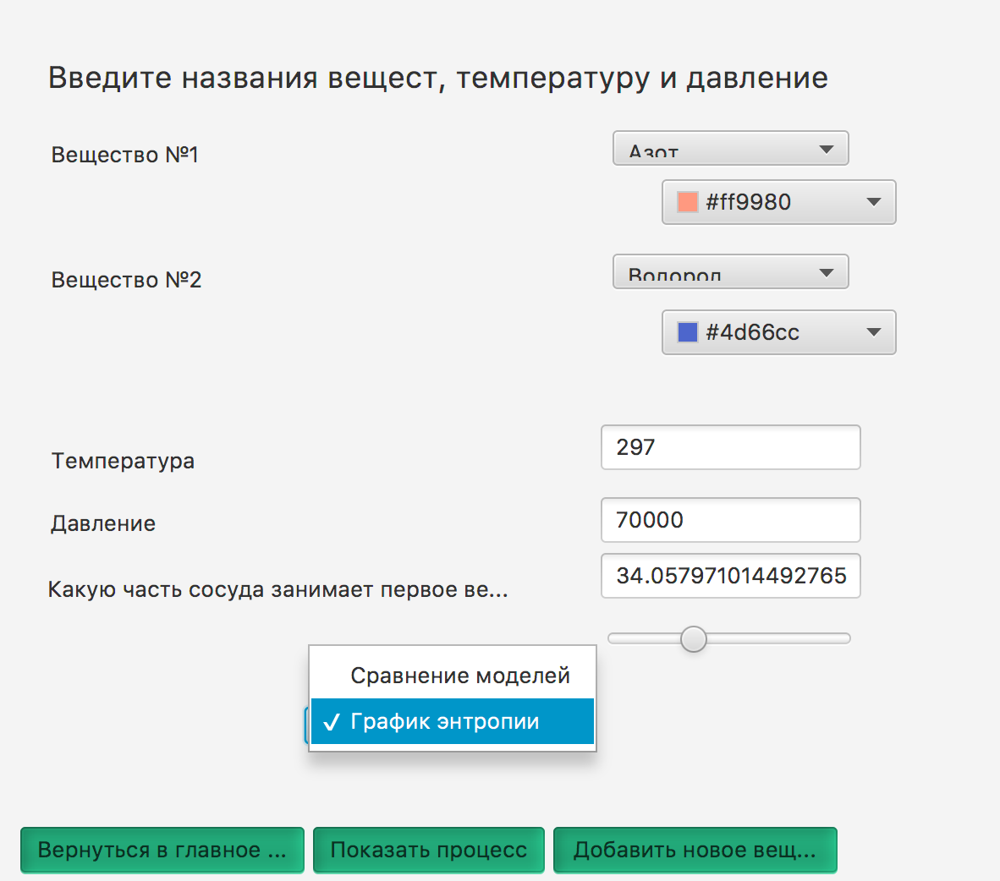
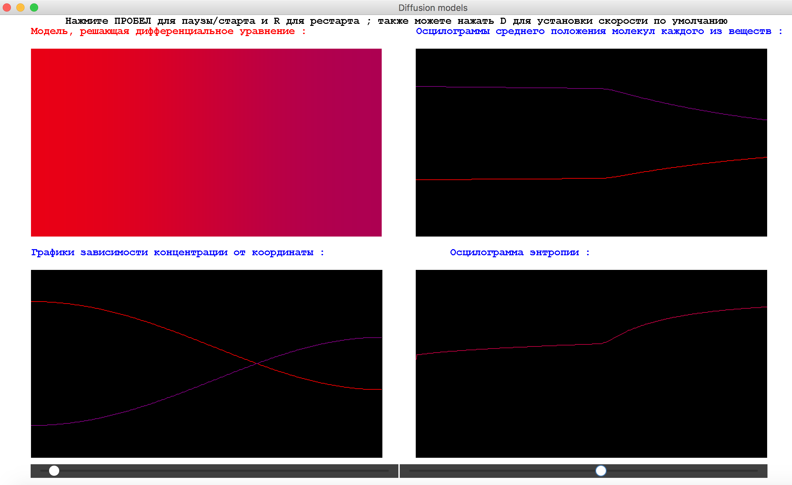
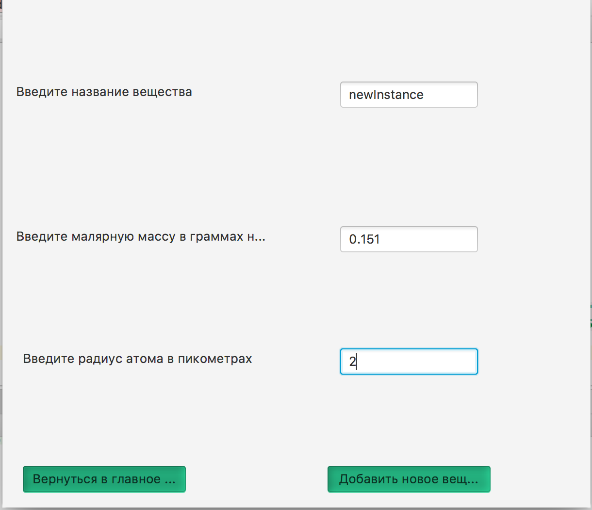
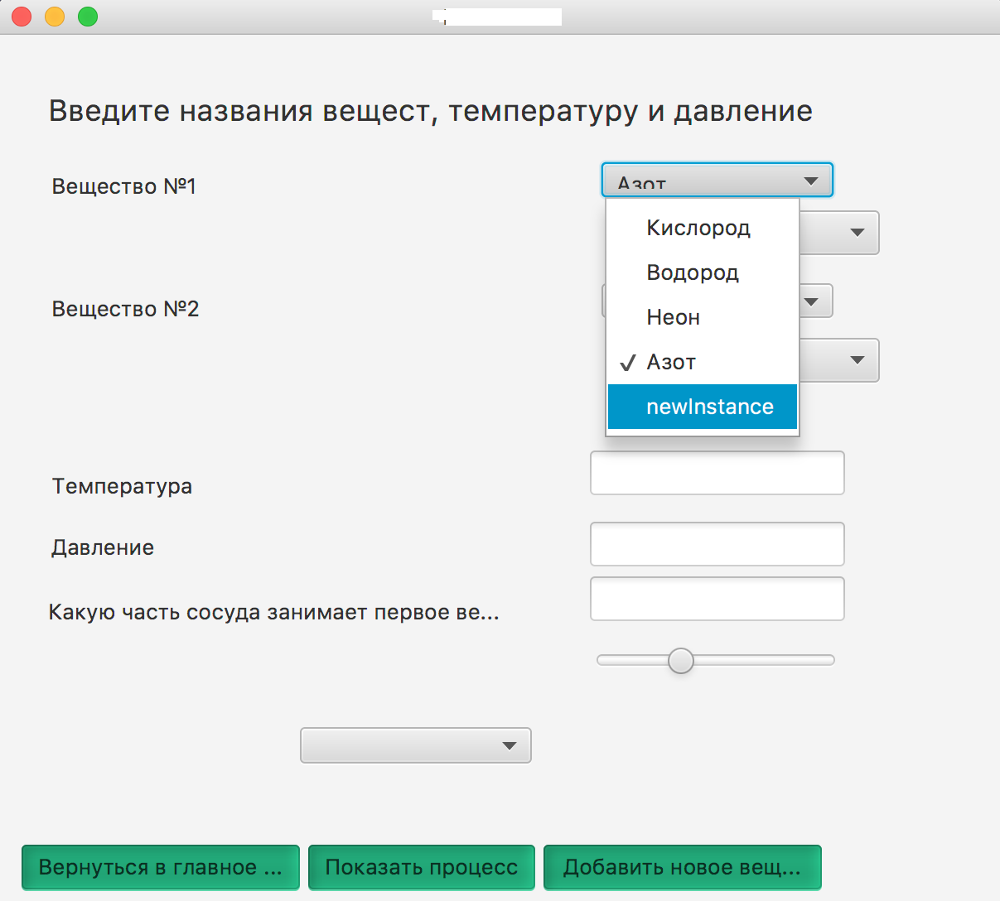

# Phisics-project-about-diffusion
Курсовой проект по физике за 1й семестр. Программа уммет моделировать диффузию в жидкостях и газах (2d-случай),
рисовать графики энтропии, средних положений молекул вещества, а также сравнивать 2 модели диффузии. 

Так выглядит начальный экран приложения :

В случае, если пользователь выбрал моделирование диффузии в жидкостях, ему предлагается выбрать их цвета, начальное положение перегородки (в процентах от общей длины сосуда), а также ввести коэффицент диффузии и выбрать, что хочет пользователь : посмотреть на 2 модели диффузии или на графики энтрапии.

Так выглядят две модели диффузии в один из моментов времени (левая - решает дифференциальное уравнение, правая - использует усреднение). Под наглядными моделями рисуются графики распределения молекул каждого из веществ. Также пользователь может регулировать скорость процесса (ползунок снизу) :

А так выглядет экран приложения, если пользователь выбрал моделирование в газах : ему предлагается выбрать одно из доступных веществ и их цвета для наглядности. Также можно ввести температуру (в К), давление(в Па) и положение перегородки. А на скриншоте справа - графики энтрапии и среднего положения веществ, в зависимости от времени. В случае газов помимо ползунка скорости появляется также ползунок температуры, которую можно регулировать в реальном времени :

Также пользователь может добавлять свои новые газы, задавая параметры их молекул :

