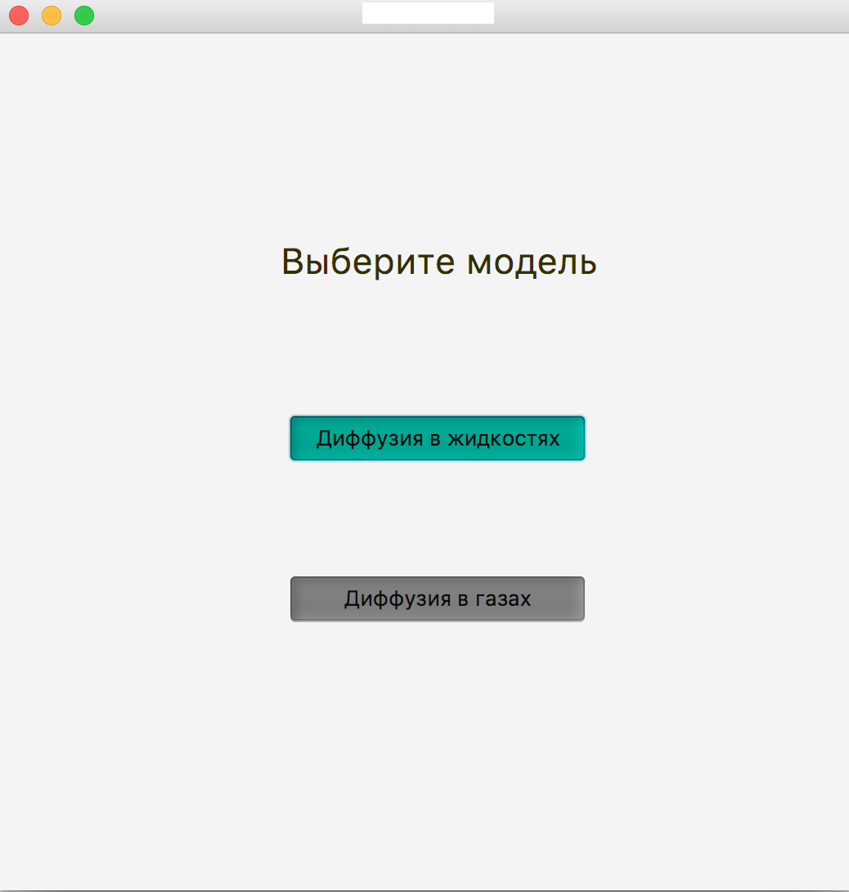
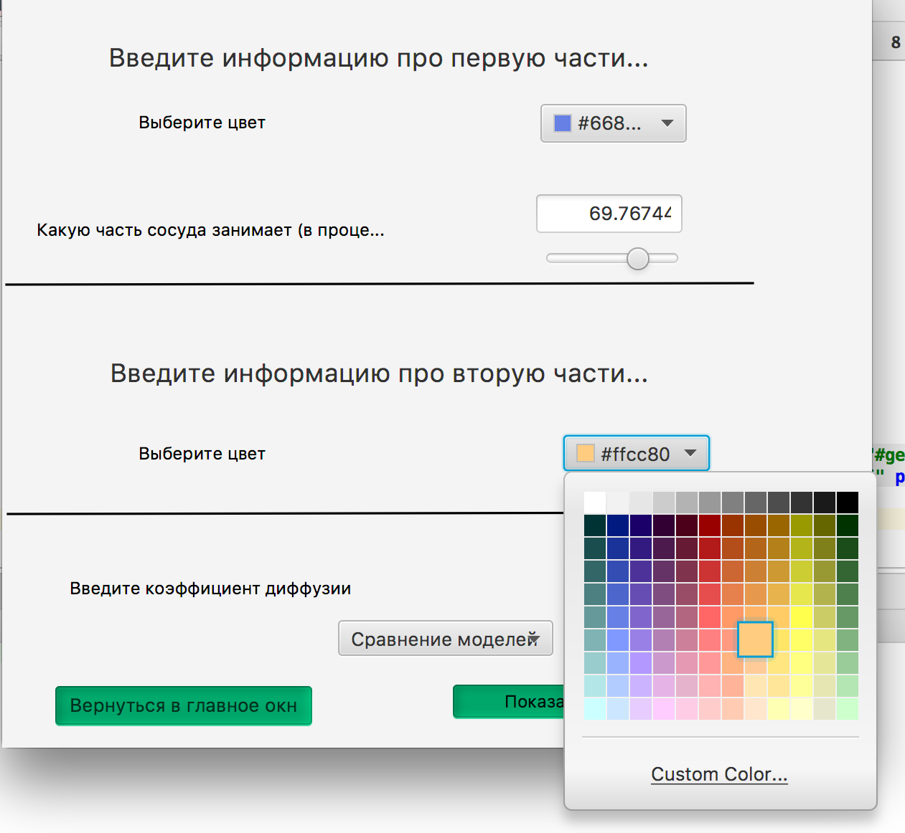
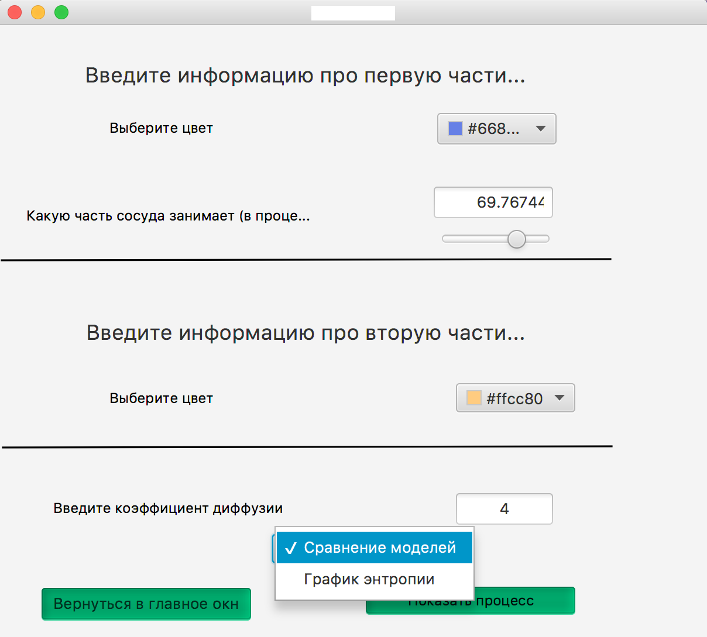

# Phisics-project-about-diffusion
Курсовой проект по физике за 1й семестр. Программа уммет моделировать диффузию в жидкостях и газах (2d-случай),
рисовать графики энтропии, средних положений молекул вещества, а также сравнивать 2 модели диффузии. 

Так выглядит начальный экран приложения :

В случае, если пользователь выбрал моделирование диффузии в жидкостях, ему предлагается выбрать их цвета, начальное положение перегородки (в процентах от общей длины сосуда), а также ввести коэффицент диффузии и выбрать, что хочет пользователь : посмотреть на 2 модели диффузии или на графики энтрапии.

